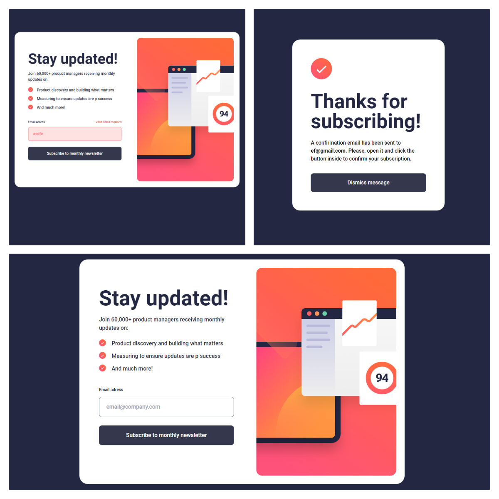
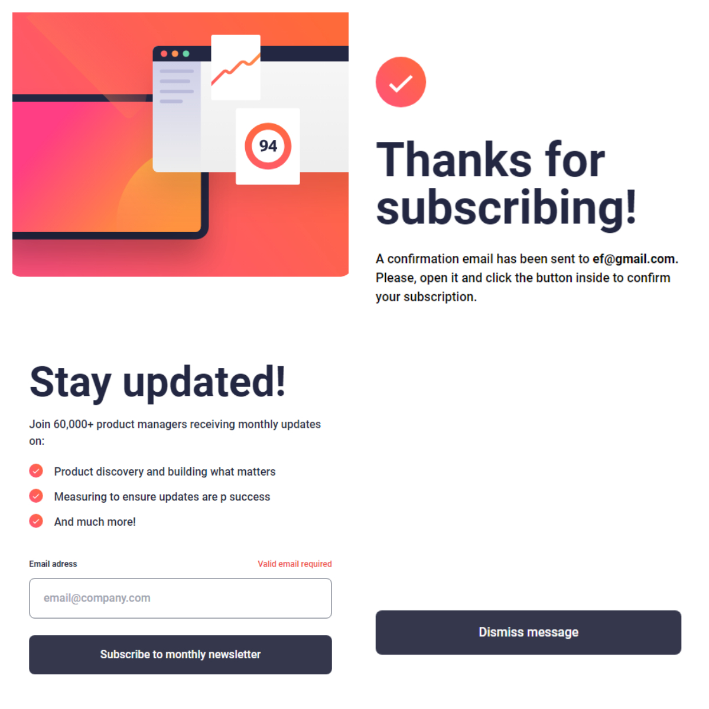

## isValidEmail(email):
 Bu yardımcı işlev, gelen e-posta parametresinin geçerli olup olmadığını kontrol eder. Geçerli bir e-posta adresi için düzgün bir biçim (ör. example@example.com) gereklidir. Geçerli bir e-posta adresi biçimi olduğunda 'true' döndürür, aksi takdirde 'false' döndürür.

## updateWindowWidth(): 
Bu işlev, pencerenin genişliğini dinamik olarak günceller ve windowWidth state'ini yeni pencere genişliği değeri ile günceller.

## handleEmailChange(e):
 Bu işlev, e-posta giriş alanına girilen her yeni karakterde tetiklenir. Kullanıcının girdiği yeni e-posta adresini alır ve e-posta adresinin geçerli olup olmadığını doğrular. Eğer e-posta geçerli değilse, isEmailError state'ini 'true' olarak ayarlar.

## handleSubscription():
 Bu işlev, "Subscribe to monthly newsletter" düğmesine tıkladığında çalışır. E-posta adresinin geçerli olup olmadığını kontrol eder ve eğer geçerliyse, başarılı bir abonelik işlemi mesajını gösterir.

## useEffect():
 Bu React Hook, sayfa yüklendiğinde veya yeniden render edildiğinde çalışır. İlk olarak, pencere genişliğini windowWidth state'ine atar. Ardından, bir 'resize' event listener'ı ekler. Bu listener, pencere boyutu değiştiğinde updateWindowWidth işlevini çağırır. Böylece, pencere genişliği dinamik olarak güncellenir. Bu hook'un döndürdüğü işlev, component çıkarıldığında veya yeniden render edilmeden önce çalışır ve 'resize' event listener'ını temizler. Bu, performansı artırmak ve hafızayı verimli bir şekilde kullanmak için gereklidir.#
